# DERP (Simplified ERP System with React)

## Technology used
This Application is build with ReactJS and TailwindCSS for UI and Redux Toolkit for State management. This application is build upon `Vite`.

## Requirements
- ### Node package manager(npm):
  You need to have npm on your device. For that you can download NodeJs using different method according to your Operating System. NPM helps in managing actions related to modules. It'a default package manager for Node.js, a Javascript runtime environment. NPM is used to manage local dependencies of project and other global JS tools.

## Usage:
Follow these steps:
1. Clone this repository to local device.
2. Run Terminal on the repository
3. Run `npm install` to download required modules
4. Run `npm run dev` to run application on local device
5. Use the local dev URL in browser mentioned in terminal.

## Additional Features
- **Redux toolkit:** This project utilizes redux toolkit for state management. Redux store configuration can be found in `src/store`.
- **react-router-dom:** For handling routing in app, `react-router-dom` is used. The routes are defined in `App.jsx` in `src` directory.
  
## About
This is simplified ERP system, designed and developed to manage basic business operations efficiently. The system is consist of the following pages.
- Dashboard - Provides an overview of system's feature containing routes to all the functionalities.
- Product Management - Present a list of products with details such as name, category, price and stock quantity, using mock data and contain functionalities to add, edit and delete products.
- Order Management - Show a list of orders with their corresponding details such as Order Id and such, contain functionalities to create, update, delete orders and allow the user to edit order status.
- Order Calendar View - Calendar that displays order on their expected delivery dates.

### Dashboard
Dashboard contains cards, Navigation link to other pages in a Sidebar, latest orders that application users made. 
- The four cards contain functionalities in this manner.
  - The first card contains list of categories that is available for user to select the product from.
  - The second card contains list of products that user can pick from according to the categories.
  - The third card contains all the order that is made from the application
  - Fourth card have accumulation of price according to quantity of each product.

The next part that dashboard contains is a list of recent made orders, where you can further find a link to see all the orders that've been made.

Dashboard also contains sidebar which you can use to navigate to different pages.

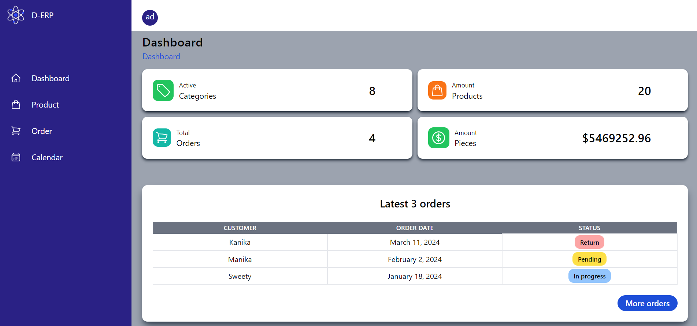
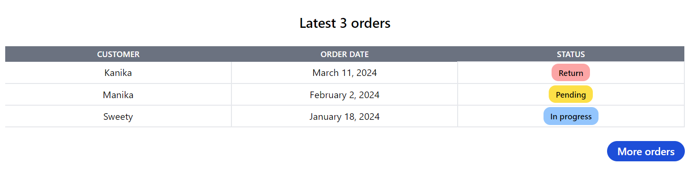

### Product management 
You can navigate to this page by using links attached in the dashboard's sidebar. This page has two section.

- **Top Section:** - Top section has two items, one is description about the application like which page the user in and a button to create a new Product.
    - Description is about the current page and it contains link back to the dashboard.
      
    - **Button:**- Button opens up a form where you can put details to create a new product.
      
        - **Product form:**- Form contains all the fields necessary to create a product.
          
          > There are few validations that are happening in the form that you need to take care of
          > - **Product name** - Product name should be unique. You can't create a product which is already in the application
          > - **Price** - You should keep price value at least 5 dollars.
          > - **Quantity** - Quantity of product that you add should be atleast 1.
          > - Button would be disable until all the validation are passed.

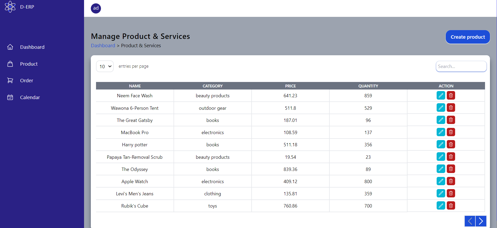

- **Table section:** - This section contains two sub sections.

  - **Table top section**- This sub-section contains a pagination functionality where you can select how many entries you want to see per page in table. Then you can traverse each page with the given arrow button below the table.
      - Another functionality is to filter product data from the table according to product name and category.

  - **Table main section**- This sub-section list all the products in the application with added functionality to edit and delete each product.
    - Last column provide the features to edit and delete a product.
      `Edit Icon in the last column opens up a modal where product details are already in the fields, if want to edit the product change the respective field and click the save button.`

      - #### Table Main
        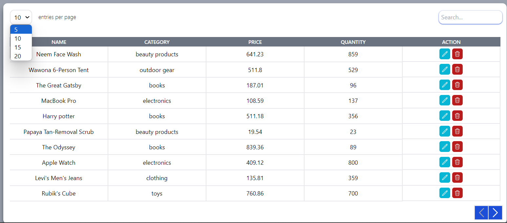
      - #### Table Search
        

          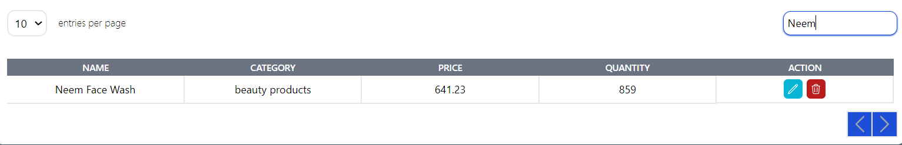
          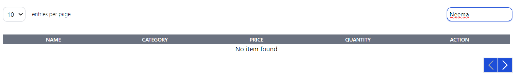
        

      - #### Product Form
         

           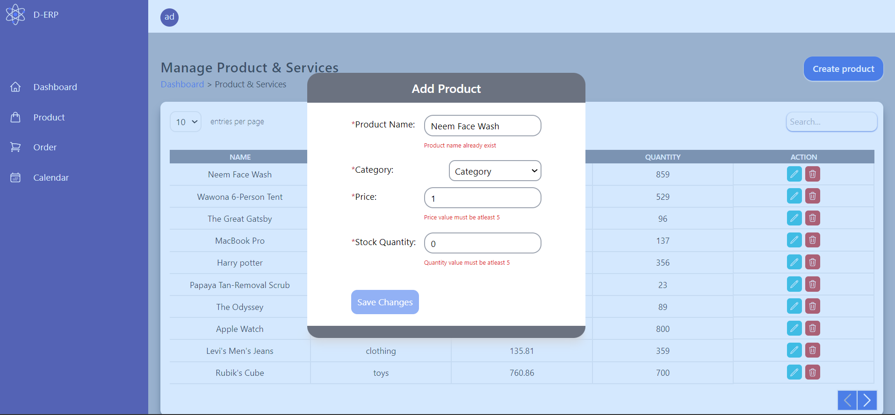
           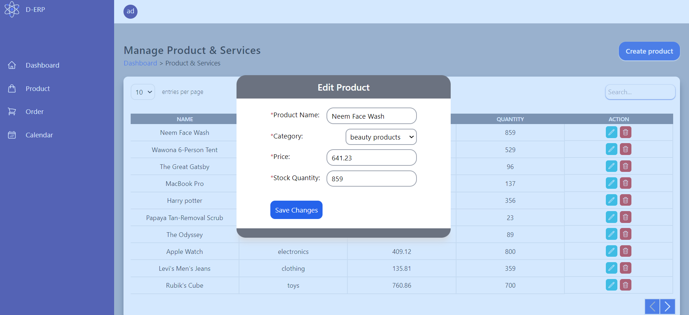
         

### Order Management
  Order Page have a Top Section where you can see which page you are in currently.
  - **Pagination and search**- User can use dropdown menu in top of the table to set the number of entries being listed in a table. Order can be searched using customer name and order id by typing into the search box. 
  - **Create order button:** - This is another functionality which Top section have. It provide user a form to create a order. Form contains field to input `customer name`, `category`, `product` and  `quantity`.
    - There are few validations that you need to understand.
      - > **Customer name** - This field should not be empty. Every order should belong to a customer.
      - > **Category** and **Product** - You need to choose category first so that products from that category are shown according to it.
      - > **Quantity** - Quantity should not be 0.

    - #### Order
      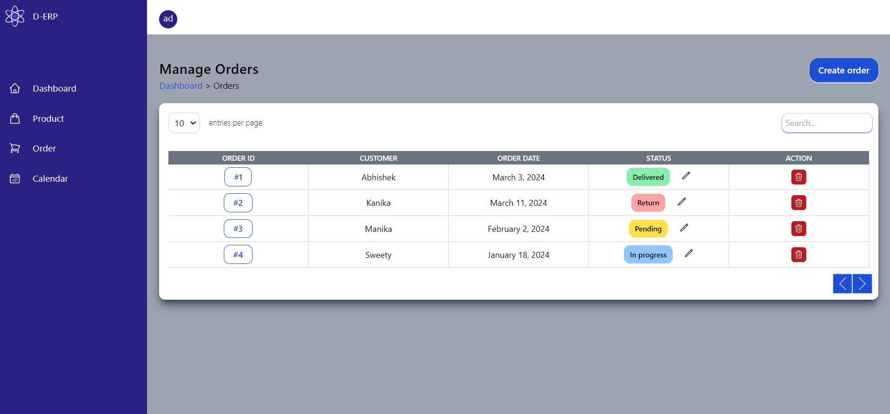

 - Order Page also contains table where you can see all the orders that've been created through the application with all the necessary columns, such as customer name, order date, status. Necessary things you can interact with in this section.
   - **Edit status of order** - Status contains the delivery status of order. Whether the order is delivered, pending or in process you can look up from this field. It also contains an edit option. By clicking on it you will see a dropdown to change a status of the order.
   - **Order Id field button**: This field contains order id which can be clicked to see the details about order like which product the user bought along with its quantity and total amount user paid to create that order.
   - **Action Field** - You can find a delete button associated with each order which you can use to delete that particular order.
  
   -  #### Order Edit status
      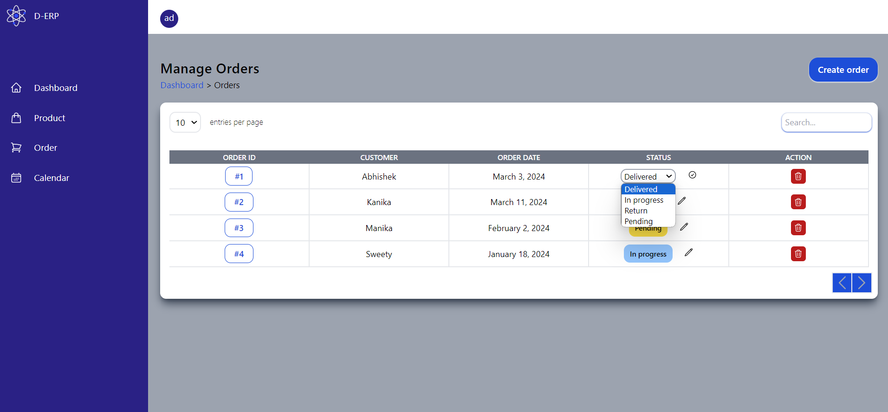
   -  #### Create Order
      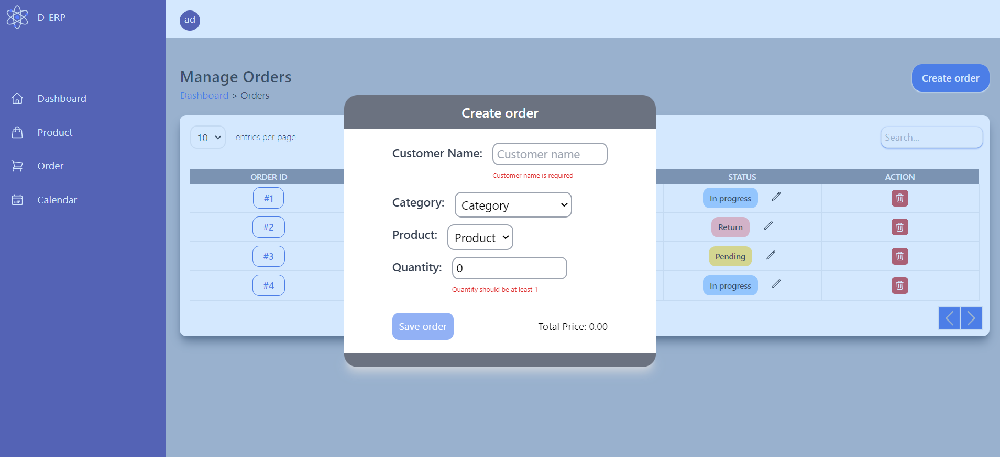

### Calendar
Calendar is used to see the number of orders on a each particular day. If there is a order on a particular date you can see that date being highlighted.
> One thing to remember is that Calendar couldn't go backward on month that has been passed already.
 - **Top section:** - This section is used to forward the months of the calendar.
 - **Order details card:** - This card contains orders on a specific date. You can view it by clicking on a date on which certain order's delivery is due.

> We are currently using Redux toolkit as a state management tool. So there's no option to store data persistently in our database. Data will only remain in the application as long as the page is not refreshed.
 - #### Calendar
    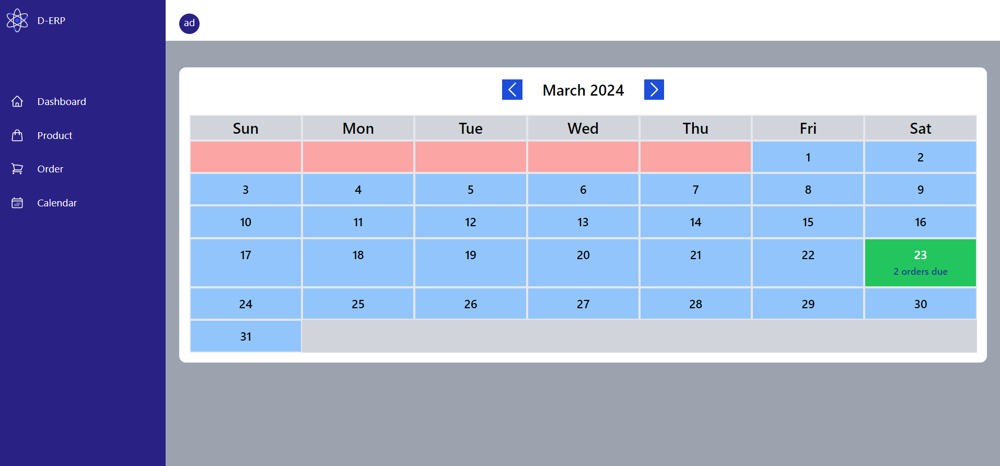
 - #### Calendar Order details
    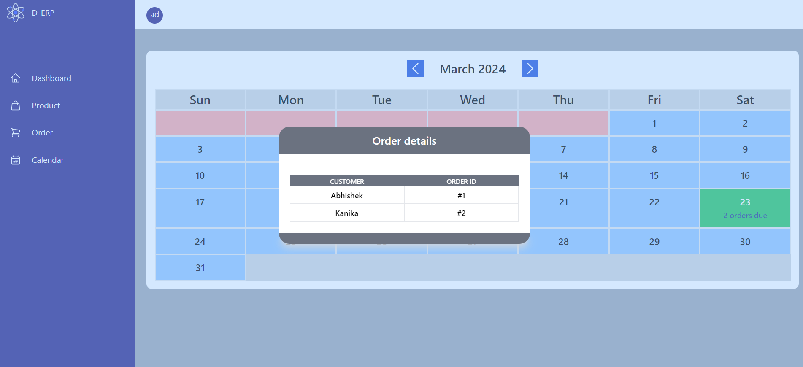

## Link
  **Live demo** - [Erp system live demo](https://derp-7f4y.vercel.app/)

